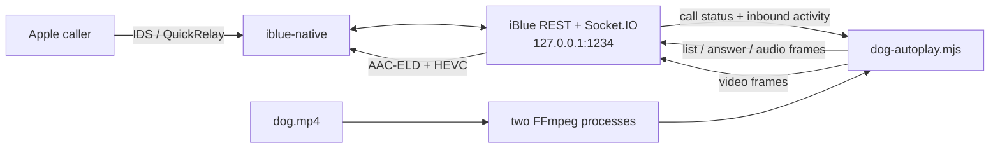

# iBlue FaceTime and automatic video responder handoff

Last verified: 2026-08-16 (America/Chicago)

Repository commit at verification: the commit that added
`facetime-native-ice-connectivity-checks.patch`.

This document describes the current macOS installation, the continuously armed
dog-video responder, the build/deploy boundary, service controls, API checks,
and the fastest way to diagnose an incoming FaceTime failure.

## Current status

The live setup is working for incoming FaceTime Audio and FaceTime Video calls
to the `secondary` iBlue profile. The profile's registered calling identity is
Jade's Apple handle; it is isolated from the account signed into the Mac's
FaceTime and Messages apps.

Verified behavior:

- Native one-to-one incoming and outgoing FaceTime audio works through iBlue's
  QuickRelay transport.
- Native one-to-one incoming and outgoing FaceTime video works. Video is sent
  as HEVC/PT100; audio is sent as AAC-ELD/PT104.
- Live audio and video can be injected over authenticated Socket.IO.
- The live video transcoder uses FaceTime's negotiated 1920x1080 camera surface,
  preserves the source aspect ratio, and fills unused space with black.
- A caller with no prior iMessage history can call Jade and receive media. This
  was verified from a previously unseen iPad after the call-local device-token,
  participant, VC UUID, and responder-key fixes in commit `af1644ce`.
- **Callers outside the Mac's local network work.** Verified 2026-08-16 from the
  same handset both on and off the Mac's Wi-Fi. Until the ICE work described
  below, only same-LAN callers ever received media; a remote caller rang, was
  answered, and then stalled until the responder's 15 s media-key deadline.
- The persistent responder detects caller hangup, stops FFmpeg, leaves the
  native call, and re-arms for the next call.
- The responder texts `+16513196252` over iMessage when a call starts and again
  when it ends, including the caller, mode, and outcome. Names come from
  `/api/v1/iblue/contact/query`; unknown numbers are reported bare.
- The responder survives a startup race with the server. Its Socket.IO connect
  is retried rather than fatal, and an unrecoverable startup failure now calls
  `process.exit(1)`. Previously it set `process.exitCode` only, which never
  terminated the process because the sockets kept the event loop alive, so
  launchd's `KeepAlive` never restarted it. The agent then sat `state = running`
  with healthy sockets and `last exit code = 0` while silently never arming —
  every incoming call went unanswered. If calls are not being answered, confirm
  `dog-autoplay.log` ends with `armed continuously` or `re-armed`; a running PID
  is not sufficient evidence.
- The latest full TypeScript suite passed: 113 tests passed and one intentionally
  skipped native multi-profile test. The native release build also passed.

Known limitations:

- A caller can remain on a **Connecting...** screen even while audio/video is
  playing correctly. In the verified iPad call, iBlue authenticated the VC
  control channel, received the control acknowledgement, delivered all 5,473
  video access units, ended the call, and re-armed. This is currently treated as
  missing presentation/connected-state signaling, not a media transport or
  teardown failure.
- The responder answers **every** incoming FaceTime Audio or Video call to Jade.
  There is currently no caller allowlist.
- Calls are handled sequentially. A second simultaneous caller is not handled
  until the active playback finishes or is stopped and the one-second re-arm
  delay expires.
- The responder script, LaunchAgent files, staging script, media file, password,
  and profile data are local operational files. They are not managed by Git.
- Launchd log rotation is not configured; the files under
  `~/Library/Logs/iBlue` continue growing until they are rotated manually.

## Remote callers and ICE

Media rides an ICE-negotiated UDP path. Three patches make a caller outside the
Mac's LAN work, and they are load bearing:

| Patch | What it does |
| --- | --- |
| `facetime-native-participant-alias.patch` | Authenticates VC control against any participant context, not only the one named by the relay hint. Required once a caller has more than one registered Apple device. |
| `facetime-native-reflexive-candidate.patch` | Publishes a server-reflexive candidate discovered by STUN from the media socket, alongside the host candidate. Previously only the private LAN address was advertised. |
| `facetime-native-ice-connectivity-checks.patch` | Learns the peer's candidates from its `ConnectionData` and sends outbound binding requests to them, nominating a pair on the response. |

The third is the one that actually unblocks remote calls. iBlue previously only
*answered* STUN binding requests and never sent any. That works on one LAN,
where no NAT sits between the devices, and fails everywhere else: an
address-restricted NAT drops the peer's checks until something has been sent
outbound to that address. With no validated pair the peer never advances past
`VCSessionMessageTopicDeviceState`, never publishes
`VCSessionMessageTopicStreamGroupsState`, and `native_media_ready` stays false
until the responder gives up.

Diagnosing a remote-call failure, in order:

```bash
rg -n 'peer ICE candidates learned|connectivity check sent|direct route selected|reflexive candidate' \
  "$HOME/Library/Logs/iBlue/serve.error.log" | tail -n 40
```

- No `reflexive candidate discovered` — STUN egress is blocked; only the host
  candidate is published and no remote caller can pair.
- No `peer ICE candidates learned` — the peer's `ConnectionData` is not being
  decoded; check the candidate/ip-candidate index pairing.
- Checks sent but no `direct route selected` — no pair validated. Symmetric NAT
  on either side will do this, and it is a property of the network rather than
  something iBlue can work around.

A quick way to tell a media-path failure from everything else: compare the VC
topics received on a good and a bad call. A healthy call shows
`StreamGroupsState`, `RateControlConfig`, and `DeviceOrientation`; a stalled one
shows only repeated `DeviceState` plus `GenerateKeyFrame`.

`facetime-native-joined-device-targeting.patch` addresses the same multi-device
problem from the other side: it records which participant's device actually
joined and addresses control to that one, rather than to a sibling device that
was invited and only rang. The hook fires from the AVC join path and was
observed on an outgoing call:

```text
FaceTime participant joined: participant=472542193749416740 joined_total=1
```

It has not yet been observed firing on an incoming responder call. Until a join
is seen, `control_target_participant` falls back to the previous alias
behaviour, so the patch can only ever redirect away from a device that never
answered.

## Quick safety control

The responder has `KeepAlive=true`. Killing only its Node process causes
launchd to start it again. To disable automatic answering while keeping the
iBlue API online, unload the responder LaunchAgent:

```bash
IBLUE_DOMAIN="gui/$(id -u)"
launchctl bootout "$IBLUE_DOMAIN" \
  "$HOME/Library/LaunchAgents/com.kyleboyer.iblue.dog-autoplay.plist"
```

Re-enable it with:

```bash
IBLUE_DOMAIN="gui/$(id -u)"
launchctl bootstrap "$IBLUE_DOMAIN" \
  "$HOME/Library/LaunchAgents/com.kyleboyer.iblue.dog-autoplay.plist"
```

## Architecture

There are two independent launchd services:

1. `com.kyleboyer.iblue` runs the staged iBlue TypeScript server and its native
   Rust helper.
2. `com.kyleboyer.iblue.dog-autoplay` connects to that server as an authenticated
   Socket.IO client, watches for calls, answers them, and streams the fixed media.



The player uses three Socket.IO connections so control/audio, video backpressure,
and remote-call monitoring do not block one another. Incoming media is subscribed
only to detect peer activity and hangup. Those frames are not persisted by the
player or inserted into messages/webhooks.

The player does **not** use iBlue's built-in `incoming/auto-answer` REST feature.
It polls `facetime-incoming-list` every 400 ms and calls
`facetime-incoming-answer` itself. Consequently, this is expected:

```text
GET /api/v1/iblue/facetime/incoming/auto-answer
=> FaceTime auto-answer is not armed.
```

Do not arm the built-in auto-answer feature while the dog responder is running;
the two answer owners can race for the same call.

## Files and directories

### Git checkout and build products

| Purpose | Location |
| --- | --- |
| Git checkout | `/Volumes/Workspace NVME/git/iBlue` |
| Compiled TypeScript | `/Volumes/Workspace NVME/git/iBlue/dist-ts` |
| Release native helper | `/Volumes/Workspace NVME/git/iBlue/pkg/rustpushgo/target/release/iblue-native` |
| Native patch-stack driver | `/Volumes/Workspace NVME/git/iBlue/scripts/prepare-rustpush.mjs` |
| FaceTime TypeScript media code | `/Volumes/Workspace NVME/git/iBlue/src/bluebubbles/facetime-media.ts` |
| FaceTime API and Socket.IO handlers | `/Volumes/Workspace NVME/git/iBlue/src/bluebubbles/server.ts` |
| Swagger descriptions | `/Volumes/Workspace NVME/git/iBlue/src/bluebubbles/openapi.ts` |
| Native FaceTime patches | `/Volumes/Workspace NVME/git/iBlue/rustpush/facetime-native-*.patch` |
| Relevant tests | `/Volumes/Workspace NVME/git/iBlue/test/bluebubbles/facetime-media.test.ts`, `facetime-incoming.test.ts`, and `server.test.ts` |

Do not hand-edit generated Go FFI bindings. Per `AGENTS.md`, change the Rust
source/patches and regenerate with the supported binding workflow when bindings
actually change. The FaceTime work described here changes the canonical
`rustpush/*.patch` stack rather than committing generated third-party files.

### Internal-disk runtime

Launchd deliberately does not execute the checkout on the external NVMe volume.
macOS removable-volume privacy controls can deny or hang a background launchd
process there. A terminal-run staging script copies build products to the
internal disk.

| Purpose | Location |
| --- | --- |
| Staged runtime | `~/Library/Application Support/iBlue/runtime` |
| Staged native helper | `~/Library/Application Support/iBlue/runtime/iblue-native` |
| Previous native backup | `~/Library/Application Support/iBlue/runtime/iblue-native.previous` |
| Main service wrapper | `~/Library/Application Support/iBlue/iblue-serve.sh` |
| Staging script | `~/Library/Application Support/iBlue/iblue-stage.sh` |
| Dog responder source | `~/Library/Application Support/iBlue/dog-autoplay.mjs` |
| Served media | `~/Library/Application Support/iBlue/media/dog.mp4` |
| Server password | `~/Library/Application Support/iBlue/server-password.txt` |
| Secondary profile | `~/Library/Application Support/iBlue/profiles/secondary` |

The staging script replaces only staged build/runtime content. It does not
replace the responder script, media, LaunchAgents, password file, logs, or
profile state.

Sensitive files include `server-password.txt`, `credential.key`, `session.json`,
and the profile SQLite databases. Do not paste them into an issue or handoff.
Service logs also contain caller handles, session UUIDs, participant IDs, and
protocol diagnostics and should be redacted before sharing.

### LaunchAgents and logs

| Service | LaunchAgent | Standard output | Standard error |
| --- | --- | --- | --- |
| iBlue API/native engine | `~/Library/LaunchAgents/com.kyleboyer.iblue.plist` | `~/Library/Logs/iBlue/serve.log` | `~/Library/Logs/iBlue/serve.error.log` |
| Automatic dog responder | `~/Library/LaunchAgents/com.kyleboyer.iblue.dog-autoplay.plist` | `~/Library/Logs/iBlue/dog-autoplay.log` | `~/Library/Logs/iBlue/dog-autoplay.error.log` |

Both agents use `RunAtLoad=true` and `KeepAlive=true`.

## Current media pipeline

The installed source is approximately 218.99 seconds long and contains:

- H.264 video, 1920x820, approximately 23.976 fps;
- AAC stereo audio at 44.1 kHz; and
- a file size of approximately 48.4 MB.

For each call, the responder launches two independent FFmpeg processes:

- Audio becomes 24 kHz mono `f32le`, sent as acknowledged 1,920-byte/20 ms
  frames. The native helper encodes it as AAC-ELD/PT104.
- Video becomes H.264 Annex-B at 640x360, 25 fps, no B-frames, with access-unit
  delimiters and a constrained 400-500 kb/s bitrate. iBlue's persistent
  VideoToolbox pipeline converts that to HEVC/PT100 on FaceTime's 1920x1080
  camera canvas.

Audio establishes a shared media clock approximately two seconds in the future;
video starts on the same epoch and RTP timestamp base. This lead is intentional:
it gives both pipelines time to fill without starting audio before video.

For FaceTime Audio calls, only audio is played. For FaceTime Video calls, both
tracks are played. The responder waits up to 15 seconds for authenticated native
media keys, detects remote call state/media ending, cleans up both track owners,
leaves the call, sleeps one second, and re-arms.

## Service control

Set a reusable launchd domain for the current GUI login:

```bash
IBLUE_DOMAIN="gui/$(id -u)"
```

### Inspect

```bash
launchctl print "$IBLUE_DOMAIN/com.kyleboyer.iblue"
launchctl print "$IBLUE_DOMAIN/com.kyleboyer.iblue.dog-autoplay"
```

A healthy agent reports `state = running` and a PID. For a compact view:

```bash
launchctl print "$IBLUE_DOMAIN/com.kyleboyer.iblue" \
  | rg 'state =|pid =|last exit code'
launchctl print "$IBLUE_DOMAIN/com.kyleboyer.iblue.dog-autoplay" \
  | rg 'state =|pid =|last exit code'
```

### Restart without unloading

Restart the player after changing `dog-autoplay.mjs` or `dog.mp4`:

```bash
launchctl kickstart -k \
  "$IBLUE_DOMAIN/com.kyleboyer.iblue.dog-autoplay"
```

Restart iBlue after staging a new TypeScript/native build:

```bash
launchctl kickstart -k "$IBLUE_DOMAIN/com.kyleboyer.iblue"
```

The Socket.IO client reconnects after a server restart, but explicitly
restarting the responder too gives a clean test boundary:

```bash
launchctl kickstart -k "$IBLUE_DOMAIN/com.kyleboyer.iblue"
launchctl kickstart -k \
  "$IBLUE_DOMAIN/com.kyleboyer.iblue.dog-autoplay"
```

Do not restart either service during an active test call unless terminating the
call is intentional.

### Stop/unload and start/load

For maintenance, stop the responder first and the server second:

```bash
launchctl bootout "$IBLUE_DOMAIN" \
  "$HOME/Library/LaunchAgents/com.kyleboyer.iblue.dog-autoplay.plist"
launchctl bootout "$IBLUE_DOMAIN" \
  "$HOME/Library/LaunchAgents/com.kyleboyer.iblue.plist"
```

Start the server first, confirm it is healthy, and then start the responder:

```bash
launchctl bootstrap "$IBLUE_DOMAIN" \
  "$HOME/Library/LaunchAgents/com.kyleboyer.iblue.plist"

curl -fsS http://127.0.0.1:1234/docs/ >/dev/null

launchctl bootstrap "$IBLUE_DOMAIN" \
  "$HOME/Library/LaunchAgents/com.kyleboyer.iblue.dog-autoplay.plist"
```

If `bootstrap` says the service is already loaded, use `kickstart -k`. If
`kickstart` says the service is not found, use `bootstrap`.

### Validate plist edits

After changing a LaunchAgent file:

```bash
plutil -lint "$HOME/Library/LaunchAgents/com.kyleboyer.iblue.plist"
plutil -lint \
  "$HOME/Library/LaunchAgents/com.kyleboyer.iblue.dog-autoplay.plist"
```

Unload and bootstrap the edited agent; `kickstart` alone does not reload plist
configuration.

## Build and deploy

Run builds from a normal Terminal session with access to the external volume:

```bash
cd "/Volumes/Workspace NVME/git/iBlue"
npm run check
npm test
npm run build:typescript
npm run build:native
```

`build:native` prepares the pinned Rust dependency/patch stack and produces:

```text
pkg/rustpushgo/target/release/iblue-native
```

Stage the build onto the internal disk and restart the live services:

```bash
"$HOME/Library/Application Support/iBlue/iblue-stage.sh"

IBLUE_DOMAIN="gui/$(id -u)"
launchctl kickstart -k "$IBLUE_DOMAIN/com.kyleboyer.iblue"
launchctl kickstart -k \
  "$IBLUE_DOMAIN/com.kyleboyer.iblue.dog-autoplay"
```

The staging script uses `rsync --delete` for staged `dist-ts` and
`node_modules`, then copies `package.json` and the release native executable.
Do not point launchd back at the external checkout.

Confirm the native artifact was actually deployed:

```bash
cd "/Volumes/Workspace NVME/git/iBlue"
shasum -a 256 \
  pkg/rustpushgo/target/release/iblue-native \
  "$HOME/Library/Application Support/iBlue/runtime/iblue-native"
```

The two hashes must match. At the 2026-08-16 verification snapshot, both were:

```text
8485acbd4be8c37d6c7bf41ec7d364c70f5a655da034470c35c822dcf7f3a3a7
```

Replacing the native executable on disk does not hot-reload the already-running
native sidecar. Restart the main iBlue LaunchAgent after every native deploy.

## API and Swagger checks

The server listens on loopback port 1234.

- Swagger UI: <http://127.0.0.1:1234/docs/>
- OpenAPI JSON: <http://127.0.0.1:1234/openapi.json>
- FaceTime capability route: `/api/v1/iblue/facetime/capabilities`
- Realtime protocol metadata: `/api/v1/iblue/facetime/realtime`
- Incoming session list: `/api/v1/iblue/facetime/incoming`

Documentation routes are unauthenticated. Data/control routes require the server
password. Load it without printing it and unset it after the check:

```bash
IBLUE_PASSWORD_VALUE="$(< \
  "$HOME/Library/Application Support/iBlue/server-password.txt")"

curl -fsS --get \
  --data-urlencode "password=$IBLUE_PASSWORD_VALUE" \
  http://127.0.0.1:1234/api/v1/iblue/facetime/capabilities \
  | jq .

curl -fsS --get \
  --data-urlencode "password=$IBLUE_PASSWORD_VALUE" \
  http://127.0.0.1:1234/api/v1/iblue/facetime/incoming \
  | jq '.data[:5]'

unset IBLUE_PASSWORD_VALUE
```

Completed sessions commonly settle as `answered-elsewhere` after iBlue leaves;
that historical state does not mean the media failed. `nativeMediaAttached` is
also false after cleanup because the call's media attachment has been removed.

## Logs

Watch the player lifecycle and errors in separate terminals:

```bash
tail -F "$HOME/Library/Logs/iBlue/dog-autoplay.log"
tail -F "$HOME/Library/Logs/iBlue/dog-autoplay.error.log"
```

Watch the iBlue server and native protocol diagnostics:

```bash
tail -F "$HOME/Library/Logs/iBlue/serve.log"
tail -F "$HOME/Library/Logs/iBlue/serve.error.log"
```

The useful player sequence is:

```text
[watch] armed continuously ...
[call SESSION] answering video from ...
[call SESSION] media ready after ...; starting dog playback with ...ms lead
[call SESSION] delivered ... compressed video access units
[call SESSION] playback completed
[watch] re-armed
```

If the caller hangs up early, `playback stopped because remote-media-ended` or
another `remote-*` reason followed by `re-armed` is expected.

Filter both log layers by one FaceTime session UUID:

```bash
IBLUE_SESSION_ID="PUT-SESSION-UUID-HERE"
rg -n "$IBLUE_SESSION_ID" \
  "$HOME/Library/Logs/iBlue/dog-autoplay.log" \
  "$HOME/Library/Logs/iBlue/dog-autoplay.error.log" \
  "$HOME/Library/Logs/iBlue/serve.log" \
  "$HOME/Library/Logs/iBlue/serve.error.log"
```

Useful native handshake markers in `serve.error.log` include:

```bash
rg -n \
  'Seeded FaceTime device prekey|Published FaceTime responder key material|VC control authenticated|VC acknowledgement received|StreamGroupsState|outbound audio template|outbound video' \
  "$HOME/Library/Logs/iBlue/serve.error.log" | tail -n 200
```

Search for serious failures:

```bash
rg -ni \
  'panicked|fatal|failed|timed out|media keys are not ready|No SKM|Unable to authenticate' \
  "$HOME/Library/Logs/iBlue/serve.error.log" \
  "$HOME/Library/Logs/iBlue/dog-autoplay.error.log" | tail -n 200
```

## Troubleshooting by symptom

### The call rings but is not answered

1. Confirm both LaunchAgents report `state = running`.
2. Confirm `dog-autoplay.log` ends with `[watch] armed continuously` or
   `[watch] re-armed`.
3. Check `dog-autoplay.error.log` for Socket.IO authentication/connect errors.
4. Call the incoming-session API and verify the new session is `ringing` and
   has mode `audio` or `video`.
5. If the player exited, remember `KeepAlive` should restart it; if it is crash
   looping, `launchctl print` shows the last exit status and the error log gives
   the cause.

### The call is answered but no media plays

1. Find its session UUID in `dog-autoplay.log`.
2. If the player repeatedly logs `waiting for authenticated FaceTime media
   keys`, inspect the same UUID in `serve.error.log`.
3. A healthy first-time-device path should show an exact participant/device
   prekey, responder key publication, authenticated VC control, and an
   acknowledgement.
4. Verify the staged native executable hash matches the release build. An old
   running sidecar can reproduce bugs even after a new file was copied.
5. If the player reaches its 15-second key deadline, it abandons that call so a
   dead session cannot monopolize the continuous responder, then re-arms.

### Audio works but video is absent

1. Confirm the call mode in the player log is `video`; an audio call
   intentionally receives no video.
2. Look for `delivered ... compressed video access units` in
   `dog-autoplay.log`.
3. Inspect `dog-autoplay.error.log` for FFmpeg exit/error output.
4. Query `/api/v1/iblue/facetime/capabilities` and confirm native video is
   available, `outboundCodec` is `hevc-pt100`, and the transcoded output is
   1920x1080.
5. Confirm staged `dist-ts/src/bluebubbles/facetime-media.js` matches the build;
   the old 1280x720 output caused stretched/blurred edge bars on iOS.

### Playback ends when the caller hangs up, but the next call is ignored

The expected log is a `remote-*` stop reason followed by `[watch] re-armed`.
If `re-armed` is missing, inspect the error log and restart the responder. The
current cleanup explicitly stops FFmpeg, finishes video/audio ownership,
unsubscribes inbound monitoring, leaves the call, and waits one second.

### The caller sees Connecting... while the media works

This is the current known signaling/UI limitation. First confirm the native log
contains `VC control authenticated` and `VC acknowledgement received`, and that
the player completes and re-arms. If so, the actual encrypted media path and
teardown are healthy. Preserve that call's session UUID for future work on the
missing connected/presentation-state message.

### Calls start correctly and then become choppy or disconnect

The current player sends audio and video concurrently on separate Socket.IO
connections and uses acknowledged backpressure. Check for:

- stale audio/video packet drops;
- FFmpeg termination;
- QuickRelay/STUN route changes;
- missing control acknowledgements;
- caller-side network changes; and
- a growing gap between source presentation timestamps and native send time.

Do not remove the two-second shared media lead or collapse audio/video onto one
Socket.IO connection without repeating the counting-video synchronization test.

## Replacing the served media

The responder expects the fixed path:

```text
~/Library/Application Support/iBlue/media/dog.mp4
```

The current script also hardcodes `sourceDurationSeconds`. Replacing the file
without updating the duration can end early or wait beyond the source. Before a
replacement:

1. Disable/unload the dog responder.
2. Verify the new file contains both an audio and video stream.
3. Inspect its exact duration with:

   ```bash
   ffprobe -v error \
     -show_entries format=duration:stream=codec_type,codec_name,width,height,sample_rate,channels \
     -of json "/absolute/path/to/replacement.mp4"
   ```

4. Back up the existing media, copy the replacement to `media/dog.mp4`, and
   update `sourceDurationSeconds` in `dog-autoplay.mjs`.
5. Re-enable the responder and watch both dog logs through one complete call.

The source need not already be FaceTime-ready. FFmpeg normalizes it to the
player's bounded H.264/audio input formats, and iBlue performs the final native
audio/video encoding.

## Recovery and rollback

If a new native build breaks incoming calls, the prior deployed helper is kept
at:

```text
~/Library/Application Support/iBlue/runtime/iblue-native.previous
```

Stop the responder and main service before replacing the executable, restore
the previous file with executable permissions, then bootstrap the main service
and responder in that order. Prefer rebuilding/staging a known Git commit over
long-term use of the ad-hoc backup, because TypeScript and native protocol
changes can be coupled.

If the profile itself needs account repair, do not delete the profile databases
or credential files as a first step. Capture the logs, run the profile-aware
doctor/registration inspection commands from the checkout, and only perform a
new Apple login when the failure is actually registration or credential related.

## Handoff checklist

Before leaving the responder unattended:

- [ ] `git status --short` is understood and intended.
- [ ] `npm run check` and `npm test` pass.
- [ ] TypeScript and native release artifacts have been rebuilt and staged.
- [ ] The staged native hash matches the checkout build.
- [ ] The iBlue API LaunchAgent is running and `/docs/` responds.
- [ ] The responder LaunchAgent is running and its log says `armed`.
- [ ] One audio call and one video call complete and re-arm.
- [ ] A first-time device/caller test succeeds if participant-handshake code changed.
- [ ] The broad auto-answer behavior is intentional for the current test window.
- [ ] Session UUIDs for any Connecting/UI anomalies have been preserved.
