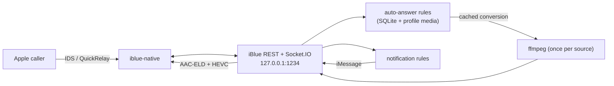

# iBlue FaceTime handoff

Last verified: 2026-08-16 (America/Chicago)

Repository commit at verification: `ab16a83e`
(`Answer group FaceTime video calls as video`).

This document describes the macOS installation, the built-in auto-answer and
notification features, the build/deploy boundary, service controls, API checks,
and the fastest way to diagnose a FaceTime failure.

> The external `dog-autoplay.mjs` responder this document used to describe has
> been retired. Auto-answer now lives in iBlue itself as durable rules with CRUD
> routes, so nothing polls the incoming-call list from outside the server. Its
> LaunchAgent is booted out but still present on disk; sections below that
> mention it are retained only for the rollback path.

## Current status

The live setup answers incoming FaceTime Audio and Video calls to the
`secondary` iBlue profile, one-to-one and group, from callers on or off the
Mac's network. The profile's registered calling identity is a dedicated Apple
handle isolated from the account signed into the Mac's FaceTime and Messages
apps.

Verified behavior:

- One-to-one incoming and outgoing FaceTime audio and video. Video is sent as
  HEVC/PT100, audio as AAC-ELD/PT104.
- **Callers outside the Mac's local network.** Verified from the same handset on
  and off the Mac's Wi-Fi, and from a cellular peer. Before the ICE work below,
  only same-LAN callers ever received media.
- **Group FaceTime audio and video.** Verified on live group calls: control
  authenticated with zero failures, `StreamGroupsState` received, media played.
- Live audio and video injection over authenticated Socket.IO.
- A caller with no prior iMessage history can call and receive media.
- Auto-answer rules select media by caller and by audio/video, survive restart,
  and answer repeatedly.
- Notification rules text a chosen handle on call and message events, with
  templates, caller filters, event filters, and duplicate suppression.

Known limitations:

- **Outgoing group calls are still one-to-one.** Three guards enforce this:
  `pkg/rustpushgo/src/lib.rs` (`create_native_media_session`,
  `create_native_live_audio_session`) and
  `src/bluebubbles/facetime-media.ts` (`input.targets.length !== 1`).
- **Capabilities still advertise `topology: "one-to-one"`** in six places across
  `server.ts`, `facetime-media.ts`, and `native/engine.ts`. That is now wrong
  for incoming calls.
- **Media fan-out is unexercised with three or more participants.** Verified
  group calls had two participant contexts but one real remote peer. Fan-out
  sends the same ciphertext per participant over the relay, which is correct in
  principle because `my_mkm` is one outbound key re-wrapped per peer, but it has
  never been observed with several genuine participants.
- A caller can remain on a **Connecting...** screen while media plays correctly.
  Treated as missing presentation/connected-state signaling rather than a
  transport failure.
- Auto-answer rules answer one call at a time. A ring arriving during playback
  is left alone rather than interrupting the call in progress.
- LaunchAgent files, the staging script, media, password, and profile data are
  local operational files not managed by Git.
- Launchd log rotation is not configured; files under `~/Library/Logs/iBlue`
  grow until rotated manually.

## Auto-answer and notification rules

Both are durable, profile-local, and managed over the API. Media for a rule is
stored under the profile and converted once; conversions are cached by source
identity so a caller is not left ringing through a repeated ffmpeg run.

| Purpose | Route |
| --- | --- |
| Auto-answer rules | `/api/v1/iblue/facetime/incoming/auto-answer/rules` (+ `/:id`) |
| Notification rules | `/api/v1/iblue/notification/rules` (+ `/:id`, `/:id/test`) |

Auto-answer matching is by explicit priority, then caller specificity so a rule
naming the caller beats a catch-all, then id. An empty `callers` list matches
everyone; `mode: any` matches audio and video. The one-shot arm at
`/incoming/auto-answer` still exists and outranks a standing rule for the very
next call.

Notification rules subscribe to `incoming-facetime`, `ft-call-status-changed`,
`facetime-auto-answer-rule-matched`, `new-message`, and the membership and
delivery events, or `*`. Templates support `{who}`, `{caller}`, `{callerName}`,
`{mode}`, `{status}`, `{outcome}`, `{duration}`, `{durationSeconds}`,
`{error}`, `{sessionId}`, `{text}`, and `{name}`. Prefer `{who}`: it renders
the handle plus contact name when known and degrades to the bare handle, where
composing `{caller} ({callerName})` leaves empty parentheses.

Two behaviours worth knowing before subscribing to lifecycle events:

- `ft-call-status-changed` has **two producers**. The incoming-signal path sends
  `status`; the media lifecycle dispatches the whole call object with `state`
  and fires on every transition. Use `filters`, for example
  `{"status": ["ended", "declined"]}`, or a single call produces one text per
  state.
- Identical text for one rule is suppressed for five minutes, which is a
  backstop rather than a substitute for filters.

## Group FaceTime

Group calls work for incoming audio and video. The findings that made that
possible are not obvious from the code and are expensive to rediscover:

- **Group calls arrive as `ConversationMessageType::Unknown`**, not `Invitation`
  or `AddMember`. Code that switches on the message type will silently not run.
  `is_video` was gated on `Invitation`, so every group video call was answered
  as audio-only until it learned to read an explicit `video_enabled`/`video`/
  `av_mode` flag from any type.
- **Peer prekeys arrive over IDS on commands 207 and 210**, never as QuickRelay
  type-11 material. The paths that consume them only seed the link when a
  connection already exists, and `ensure_allocations` only harvests the cache
  while building one, so a prekey arriving after the connection is up was
  cached and never seeded. Bootstrap then failed with `NotConnected` for the
  whole call.
- **Peer VC session UUIDs are not delivered over QuickRelay in a group call.**
  They are read from each participant's plaintext AVC blob at connection setup,
  ported from upstream's `avconference::import_avc`. Doing this on message
  receipt does not work: the state changes during a group call carry an empty
  `active_participants`, so the cached blobs from the invitation are the only
  copies. Without them every participant lacks an `avc_uuid`, `peer_uuids` is
  zero, and no control message can be authenticated.
- **`ResendAVCBlobRequest` is unimplemented upstream.** `callservicesd` names the
  exchange `handleConversation:receivedBlobRecoveryRequest:`/`Response:` and
  warns that a response must carry a participant the receiver can add or update.
  iBlue answers it by re-advertising with the message type overridden, and
  allocates first, because the blob only carries this side's public prekey once
  a connection exists.
- **Apple's `ConversationMessage` has a `requestBlobRecoveryOptions` field this
  proto does not model** (the numbering skips 18, 26, 27). Replies ignore it and
  send the full blob, which has been sufficient so far.

The upstream `rustpush` pin is `origin/ft-testing`, which diverged from upstream
`main` in April 2026. `main` has since restructured FaceTime into an
`avconference` module with per-participant encryption state. Re-pinning was
measured: of the current patch stack, **4 patches apply and 54 fail**, so it is a
rewrite rather than a rebase. Port ideas backward instead unless that rewrite is
deliberately scheduled.

## Remote callers and ICE

Media rides an ICE-negotiated UDP path. Three patches make a caller outside the
Mac's LAN work, and they are load bearing:

| Patch | What it does |
| --- | --- |
| `facetime-native-participant-alias.patch` | Authenticates VC control against any participant context, not only the one named by the relay hint. Required once a caller has more than one registered Apple device. |
| `facetime-native-reflexive-candidate.patch` | Publishes a server-reflexive candidate discovered by STUN from the media socket, alongside the host candidate. Previously only the private LAN address was advertised. |
| `facetime-native-ice-connectivity-checks.patch` | Learns the peer's candidates from its `ConnectionData` and sends outbound binding requests to them, nominating a pair on the response. |

The third is the one that actually unblocks remote calls. iBlue previously only
*answered* STUN binding requests and never sent any. That works on one LAN,
where no NAT sits between the devices, and fails everywhere else: an
address-restricted NAT drops the peer's checks until something has been sent
outbound to that address. With no validated pair the peer never advances past
`VCSessionMessageTopicDeviceState`, never publishes
`VCSessionMessageTopicStreamGroupsState`, and `native_media_ready` stays false
until the responder gives up.

Diagnosing a remote-call failure, in order:

```bash
rg -n 'peer ICE candidates learned|connectivity check sent|direct route selected|reflexive candidate' \
  "$HOME/Library/Logs/iBlue/serve.error.log" | tail -n 40
```

- No `reflexive candidate discovered` — STUN egress is blocked; only the host
  candidate is published and no remote caller can pair.
- No `peer ICE candidates learned` — the peer's `ConnectionData` is not being
  decoded; check the candidate/ip-candidate index pairing.
- Checks sent but no `direct route selected` — no pair validated. Symmetric NAT
  on either side will do this, and it is a property of the network rather than
  something iBlue can work around.

A quick way to tell a media-path failure from everything else: compare the VC
topics received on a good and a bad call. A healthy call shows
`StreamGroupsState`, `RateControlConfig`, and `DeviceOrientation`; a stalled one
shows only repeated `DeviceState` plus `GenerateKeyFrame`.

When a call fails from one caller and works from everyone else, start with the
peer itself rather than the media path:

```bash
rg -n 'FaceTime peer client:|FaceTime peer key material:' \
  "$HOME/Library/Logs/iBlue/serve.error.log" | tail -n 20
```

The first line carries the caller's OS build, negotiation blob versions,
whether it supports U+1 one-to-one media, and the RTP payload types it offered;
the second carries the wrap mode, short MKI, and generation of every key it
published. [The media key exchange audit](facetime-media-key-exchange-audit.md)
reads those lines as a decision tree and lists where iBlue's exchange is
narrower than upstream's.

Four patches from that audit changed how key material is exchanged, and their
log lines are the first thing to look for on a call that never plays media:

- `Published FaceTime key material after a QuickRelay prekey` or
  `… after a wire prekey` — this side published to a participant as soon as its
  prekey arrived, rather than only during bootstrap or after an IDS command
  210/211. A peer that never sends those commands is no longer left without our
  keys.
- `Opened FaceTime inbound media key context: … selector_matched=…` — which
  peer key an inbound stream resolved to. `selector_matched=false` means the
  sender is not using Apple's two-byte SRTP selector.
- `No FaceTime media key for an inbound key selector` — packets arrived for a
  key this side does not hold.
- `Skipping unverified FaceTime QuickRelay material` — material that failed
  verification is now skipped rather than taking the link down.

Readiness for an answered call no longer waits for a command 210 or 211: it
waits for the key exchange itself, so `native_media_ready` turns true once this
side has published material and imported a peer's.

`facetime-native-joined-device-targeting.patch` addresses the same multi-device
problem from the other side: it records which participant's device actually
joined and addresses control to that one, rather than to a sibling device that
was invited and only rang. The hook fires from the AVC join path and was
observed on an outgoing call:

```text
FaceTime participant joined: participant=472542193749416740 joined_total=1
```

It has not yet been observed firing on an incoming responder call. Until a join
is seen, `control_target_participant` falls back to the previous alias
behaviour, so the patch can only ever redirect away from a device that never
answered.

## Quick safety control

To stop answering calls while keeping the iBlue API online, disable the
auto-answer rules. Nothing needs restarting; matching reads the rule on each
ring.

```bash
IBLUE_PASSWORD_VALUE="$(< "$HOME/Library/Application Support/iBlue/server-password.txt")"
BASE="http://127.0.0.1:1234/api/v1/iblue/facetime/incoming/auto-answer/rules"

# List rules and their enabled state
curl -fsS --get --data-urlencode "password=$IBLUE_PASSWORD_VALUE" "$BASE" \
  | jq -c '.data | map({id, name, enabled, mode, callers})'

# Disable one
curl -fsS -X PATCH "$BASE/<id>?password=$IBLUE_PASSWORD_VALUE" \
  -H 'Content-Type: application/json' -d '{"enabled":false}'

unset IBLUE_PASSWORD_VALUE
```

Notification rules are disabled the same way against
`/api/v1/iblue/notification/rules/<id>`.

To stop everything, boot out the server agent:

```bash
launchctl bootout "gui/$(id -u)" \
  "$HOME/Library/LaunchAgents/com.kyleboyer.iblue.plist"
```

## Architecture

One launchd service, `com.kyleboyer.iblue`, runs the staged iBlue TypeScript
server and its native Rust helper. Answering and notifications are internal to
that server; nothing polls from outside it.



On a ring, the server matches auto-answer rules, answers the session, and plays
the rule's media. Answering retries while the native session reports that it is
not awaiting an answer or returns `NotConnected`, because the ring event derives
from the parsed iMessage signal and can precede native readiness — routinely so
for a group call, whose prekeys arrive after the invitation.

The retired `com.kyleboyer.iblue.dog-autoplay` agent is booted out. Its plist
and script remain on disk as a rollback path. Do not load it while auto-answer
rules are enabled: two answer owners race for the same call.

## Files and directories

### Git checkout and build products

| Purpose | Location |
| --- | --- |
| Git checkout | `/Volumes/Workspace NVME/git/iBlue` |
| Compiled TypeScript | `/Volumes/Workspace NVME/git/iBlue/dist-ts` |
| Release native helper | `/Volumes/Workspace NVME/git/iBlue/pkg/rustpushgo/target/release/iblue-native` |
| Native patch-stack driver | `/Volumes/Workspace NVME/git/iBlue/scripts/prepare-rustpush.mjs` |
| FaceTime TypeScript media code | `/Volumes/Workspace NVME/git/iBlue/src/bluebubbles/facetime-media.ts` |
| FaceTime API and Socket.IO handlers | `/Volumes/Workspace NVME/git/iBlue/src/bluebubbles/server.ts` |
| Swagger descriptions | `/Volumes/Workspace NVME/git/iBlue/src/bluebubbles/openapi.ts` |
| Native FaceTime patches | `/Volumes/Workspace NVME/git/iBlue/rustpush/facetime-native-*.patch` |
| Relevant tests | `/Volumes/Workspace NVME/git/iBlue/test/bluebubbles/facetime-media.test.ts`, `facetime-incoming.test.ts`, and `server.test.ts` |

Do not hand-edit generated Go FFI bindings. Per `AGENTS.md`, change the Rust
source/patches and regenerate with the supported binding workflow when bindings
actually change. The FaceTime work described here changes the canonical
`rustpush/*.patch` stack rather than committing generated third-party files.

### Internal-disk runtime

Launchd deliberately does not execute the checkout on the external NVMe volume.
macOS removable-volume privacy controls can deny or hang a background launchd
process there. A terminal-run staging script copies build products to the
internal disk.

| Purpose | Location |
| --- | --- |
| Staged runtime | `~/Library/Application Support/iBlue/runtime` |
| Staged native helper | `~/Library/Application Support/iBlue/runtime/iblue-native` |
| Previous native backup | `~/Library/Application Support/iBlue/runtime/iblue-native.previous` |
| Main service wrapper | `~/Library/Application Support/iBlue/iblue-serve.sh` |
| Staging script | `~/Library/Application Support/iBlue/iblue-stage.sh` |
| Retired responder (rollback only) | `~/Library/Application Support/iBlue/dog-autoplay.mjs` |
| Auto-answer rule media | `<profile>/attachments/facetime-auto-answer/<uuid>/` |
| Cached media conversions | `/private/tmp/vp/inject/cache/` |
| Server password | `~/Library/Application Support/iBlue/server-password.txt` |
| Secondary profile | `~/Library/Application Support/iBlue/profiles/secondary` |

The staging script replaces only staged build/runtime content. It does not
replace the responder script, media, LaunchAgents, password file, logs, or
profile state.

Sensitive files include `server-password.txt`, `credential.key`, `session.json`,
and the profile SQLite databases. Do not paste them into an issue or handoff.
Service logs also contain caller handles, session UUIDs, participant IDs, and
protocol diagnostics and should be redacted before sharing.

### LaunchAgents and logs

| Service | LaunchAgent | Standard output | Standard error |
| --- | --- | --- | --- |
| iBlue API/native engine | `~/Library/LaunchAgents/com.kyleboyer.iblue.plist` | `~/Library/Logs/iBlue/serve.log` | `~/Library/Logs/iBlue/serve.error.log` |
| Retired responder (rollback only) | `~/Library/LaunchAgents/com.kyleboyer.iblue.dog-autoplay.plist` | `~/Library/Logs/iBlue/dog-autoplay.log` | `~/Library/Logs/iBlue/dog-autoplay.error.log` |

Both agents use `RunAtLoad=true` and `KeepAlive=true`.

## Current media pipeline

The installed source is approximately 218.99 seconds long and contains:

- H.264 video, 1920x820, approximately 23.976 fps;
- AAC stereo audio at 44.1 kHz; and
- a file size of approximately 48.4 MB.

For each call, the responder launches two independent FFmpeg processes:

- Audio becomes 24 kHz mono `f32le`, sent as acknowledged 1,920-byte/20 ms
  frames. The native helper encodes it as AAC-ELD/PT104.
- Video becomes H.264 Annex-B at 640x360, 25 fps, no B-frames, with access-unit
  delimiters and a constrained 400-500 kb/s bitrate. iBlue's persistent
  VideoToolbox pipeline converts that to HEVC/PT100 on FaceTime's 1920x1080
  camera canvas.

Audio establishes a shared media clock approximately two seconds in the future;
video starts on the same epoch and RTP timestamp base. This lead is intentional:
it gives both pipelines time to fill without starting audio before video.

For FaceTime Audio calls, only audio is played. For FaceTime Video calls, both
tracks are played. The responder waits up to 15 seconds for authenticated native
media keys, detects remote call state/media ending, cleans up both track owners,
leaves the call, sleeps one second, and re-arms.

## Service control

Set a reusable launchd domain for the current GUI login:

```bash
IBLUE_DOMAIN="gui/$(id -u)"
```

### Inspect

```bash
launchctl print "$IBLUE_DOMAIN/com.kyleboyer.iblue"
```

A healthy agent reports `state = running` and a PID. For a compact view:

```bash
launchctl print "$IBLUE_DOMAIN/com.kyleboyer.iblue" \
  | rg 'state =|pid =|last exit code'
```

### Restart without unloading

Restart iBlue after staging a new TypeScript/native build:

```bash
launchctl kickstart -k "$IBLUE_DOMAIN/com.kyleboyer.iblue"
```

Restarting the server is sufficient; auto-answer and notification rules are
read from SQLite on each event.

```bash
launchctl kickstart -k "$IBLUE_DOMAIN/com.kyleboyer.iblue"
```

Do not restart either service during an active test call unless terminating the
call is intentional.

### Stop/unload and start/load

For maintenance, stop the server:

```bash
launchctl bootout "$IBLUE_DOMAIN" \
  "$HOME/Library/LaunchAgents/com.kyleboyer.iblue.plist"
```

Start it again and confirm it is healthy:

```bash
launchctl bootstrap "$IBLUE_DOMAIN" \
  "$HOME/Library/LaunchAgents/com.kyleboyer.iblue.plist"

curl -fsS http://127.0.0.1:1234/docs/ >/dev/null

```

If `bootstrap` says the service is already loaded, use `kickstart -k`. If
`kickstart` says the service is not found, use `bootstrap`.

### Validate plist edits

After changing a LaunchAgent file:

```bash
plutil -lint "$HOME/Library/LaunchAgents/com.kyleboyer.iblue.plist"
```

Unload and bootstrap the edited agent; `kickstart` alone does not reload plist
configuration.

## Build and deploy

Run builds from a normal Terminal session with access to the external volume:

```bash
cd "/Volumes/Workspace NVME/git/iBlue"
npm run check
npm test
npm run build:typescript
npm run build:native
```

`build:native` prepares the pinned Rust dependency/patch stack and produces:

```text
pkg/rustpushgo/target/release/iblue-native
```

Stage the build onto the internal disk and restart the live services:

```bash
"$HOME/Library/Application Support/iBlue/iblue-stage.sh"

IBLUE_DOMAIN="gui/$(id -u)"
launchctl kickstart -k "$IBLUE_DOMAIN/com.kyleboyer.iblue"
```

The staging script uses `rsync --delete` for staged `dist-ts` and
`node_modules`, then copies `package.json` and the release native executable.
Do not point launchd back at the external checkout.

Confirm the native artifact was actually deployed:

```bash
cd "/Volumes/Workspace NVME/git/iBlue"
shasum -a 256 \
  pkg/rustpushgo/target/release/iblue-native \
  "$HOME/Library/Application Support/iBlue/runtime/iblue-native"
```

The two hashes must match. At the 2026-08-16 verification snapshot, both were:

```text
59f3d26f44e164defbfed9d8f38dad0f229d969e0b48644d5b6541d1ead48a8d
```

Take the value from `shasum -a 256` after a build rather than trusting this
line: the native helper is rebuilt often and this snapshot goes stale quickly.

Replacing the native executable on disk does not hot-reload the already-running
native sidecar. Restart the main iBlue LaunchAgent after every native deploy.

## API and Swagger checks

The server listens on loopback port 1234.

- Swagger UI: <http://127.0.0.1:1234/docs/>
- OpenAPI JSON: <http://127.0.0.1:1234/openapi.json>
- FaceTime capability route: `/api/v1/iblue/facetime/capabilities`
- Realtime protocol metadata: `/api/v1/iblue/facetime/realtime`
- Incoming session list: `/api/v1/iblue/facetime/incoming`

Documentation routes are unauthenticated. Data/control routes require the server
password. Load it without printing it and unset it after the check:

```bash
IBLUE_PASSWORD_VALUE="$(< \
  "$HOME/Library/Application Support/iBlue/server-password.txt")"

curl -fsS --get \
  --data-urlencode "password=$IBLUE_PASSWORD_VALUE" \
  http://127.0.0.1:1234/api/v1/iblue/facetime/capabilities \
  | jq .

curl -fsS --get \
  --data-urlencode "password=$IBLUE_PASSWORD_VALUE" \
  http://127.0.0.1:1234/api/v1/iblue/facetime/incoming \
  | jq '.data[:5]'

unset IBLUE_PASSWORD_VALUE
```

Completed sessions commonly settle as `answered-elsewhere` after iBlue leaves;
that historical state does not mean the media failed. `nativeMediaAttached` is
also false after cleanup because the call's media attachment has been removed.

## Logs

Answering, notifications, and native diagnostics all go to the server logs. The
`dog-autoplay.*` logs belong to the retired responder and stop at its last run.

```bash
tail -F "$HOME/Library/Logs/iBlue/serve.error.log"
tail -F "$HOME/Library/Logs/iBlue/serve.log"
```

Watch the iBlue server and native protocol diagnostics:

```bash
tail -F "$HOME/Library/Logs/iBlue/serve.log"
tail -F "$HOME/Library/Logs/iBlue/serve.error.log"
```

The useful player sequence is:

```text
[watch] armed continuously ...
[call SESSION] answering video from ...
[call SESSION] media ready after ...; starting dog playback with ...ms lead
[call SESSION] delivered ... compressed video access units
[call SESSION] playback completed
[watch] re-armed
```

If the caller hangs up early, `playback stopped because remote-media-ended` or
another `remote-*` reason followed by `re-armed` is expected.

Filter both log layers by one FaceTime session UUID:

```bash
IBLUE_SESSION_ID="PUT-SESSION-UUID-HERE"
rg -n "$IBLUE_SESSION_ID" \
  "$HOME/Library/Logs/iBlue/serve.log" \
  "$HOME/Library/Logs/iBlue/serve.error.log"
```

Useful native handshake markers in `serve.error.log` include:

```bash
rg -n \
  'Seeded FaceTime device prekey|Published FaceTime responder key material|VC control authenticated|VC acknowledgement received|StreamGroupsState|outbound audio template|outbound video' \
  "$HOME/Library/Logs/iBlue/serve.error.log" | tail -n 200
```

Search for serious failures:

```bash
rg -ni \
  'panicked|fatal|failed|timed out|media keys are not ready|No SKM|Unable to authenticate' \
  "$HOME/Library/Logs/iBlue/serve.error.log" | tail -n 200
```

## Troubleshooting by symptom

### The call rings but is not answered

Background failures are reported to stderr and land in `serve.error.log`:

```bash
rg -n '\[iblue\]' "$HOME/Library/Logs/iBlue/serve.error.log" | tail -n 20
```

`[iblue] facetime auto-answer failed: <reason>` names the cause directly. Note
that Fastify is constructed with `logger: false`, so anything routed to
`app.log` is discarded; use `reportBackgroundFailure` for new background work or
the failure will be invisible.

1. Confirm `com.kyleboyer.iblue` reports `state = running`.
2. Confirm an enabled auto-answer rule matches: `GET
   /api/v1/iblue/facetime/incoming/auto-answer/rules`. Check `mode`, `callers`,
   and `enabled`.
3. Confirm the retired `com.kyleboyer.iblue.dog-autoplay` agent is **not**
   loaded. Two answer owners race for the same call.
4. Verify the session is `ringing` with mode `audio` or `video` via
   `GET /api/v1/iblue/facetime/incoming`.
5. `auto-answer waiting for native readiness` followed by `still waiting after
   Ns` means the session is not yet answerable. That is expected briefly, and
   for longer on a group call.

### The call is answered but no media plays

1. Find its session UUID from `GET /api/v1/iblue/facetime/incoming` or the
   `[iblue]` lines in `serve.error.log`.
2. If the player repeatedly logs `waiting for authenticated FaceTime media
   keys`, inspect the same UUID in `serve.error.log`.
3. A healthy first-time-device path should show an exact participant/device
   prekey, responder key publication, authenticated VC control, and an
   acknowledgement.
4. Verify the staged native executable hash matches the release build. An old
   running sidecar can reproduce bugs even after a new file was copied.
5. If the player reaches its 15-second key deadline, it abandons that call so a
   dead session cannot monopolize the continuous responder, then re-arms.

### Diagnosing a stalled or silent call

FaceTime media diagnostics are **on by default**, because a call that fails once
is rarely reproducible on demand. Silence them with
`IBLUE_FACETIME_MEDIA_DIAGNOSTICS` set to `0`, `false`, `off`, or `no`; any
other value, or leaving it unset, keeps them on.

Read these markers in `serve.error.log`:

```bash
rg -n 'control target|peer ICE candidates|connectivity check|direct route selected|reflexive candidate|QuickRelay material|wire message|video mode resolved' \
  "$HOME/Library/Logs/iBlue/serve.error.log" | tail -n 40
```

- `FaceTime control target: route=… chosen=… participants=N | …[avc_uuid= mkm= skm= prekey= published= joined=]`
  — the whole participant table and which one control is addressed to. A group
  call holds one context per remote device and the one that matters is the one
  with decrypted key material.
- `Unable to authenticate FaceTime VC control message: … peer_uuids=0` — no
  participant has an AVC UUID, so nothing can be authenticated. See the group
  section: the UUIDs come from cached participant blobs at connection setup.
- `bootstrap waiting for a peer prekey` — QuickRelay cannot bootstrap. Prekeys
  arrive on IDS commands 207/210, not as QuickRelay type-11 material.
- `FaceTime QuickRelay material: owner=… receiver=… types=[…] local_allocations=[…]`
  — whether inbound material is addressed to one of our allocations. `types`
  never containing 11 is normal; prekeys do not arrive this way.
- `reflexive candidate discovered` / `connectivity check sent` / `direct route
  selected` — the ICE exchange described above. The peer's candidates also
  reveal its network: a private `192.168.x`/`10.x` candidate means Wi-Fi, while
  a carrier-public address plus a `100.64/10` CGNAT address with no private
  candidate means cellular.
- `outbound audio using canonical receive-first RTP template` followed by
  `outbound audio template: extension_profile=0x0000 extensions=0` — the sender
  never observed the peer's RTP header and guessed. Media is sent and the
  lifecycle looks healthy, but the caller renders nothing. Compare with a
  working call, which shows an observed profile such as `0x8d00 extensions=1`.
- `FaceTime inbound payload type not recognised for templating` — the peer's
  audio arrived under a payload type the template extraction ignores, which is
  what produces the fallback above. `inbound media datagram` counts confirm the
  media itself arrived.

Comparing VC topics separates a media-path failure from everything else. A
healthy call receives `StreamGroupsState`, `RateControlConfig`, and
`DeviceOrientation`; a stalled one receives only repeated `DeviceState` plus
`GenerateKeyFrame`.

### Audio works but video is absent

1. Confirm the call mode in the player log is `video`; an audio call
   intentionally receives no video.
2. Look for `delivered ... compressed video access units` in
   `serve.error.log`.
3. Inspect `serve.error.log` for ffmpeg exit/error output. A group video call
   answered as audio-only is a separate cause: see the group section on
   `is_video` resolution.
4. Query `/api/v1/iblue/facetime/capabilities` and confirm native video is
   available, `outboundCodec` is `hevc-pt100`, and the transcoded output is
   1920x1080.
5. Confirm staged `dist-ts/src/bluebubbles/facetime-media.js` matches the build;
   the old 1280x720 output caused stretched/blurred edge bars on iOS.

### Playback ends when the caller hangs up, but the next call is ignored

The expected log is a `remote-*` stop reason followed by `[watch] re-armed`.
If `re-armed` is missing, inspect the error log and restart the responder. The
current cleanup explicitly stops FFmpeg, finishes video/audio ownership,
unsubscribes inbound monitoring, leaves the call, and waits one second.

### The caller sees Connecting... while the media works

This is the current known signaling/UI limitation. First confirm the native log
contains `VC control authenticated` and `VC acknowledgement received`, and that
the player completes and re-arms. If so, the actual encrypted media path and
teardown are healthy. Preserve that call's session UUID for future work on the
missing connected/presentation-state message.

### Calls start correctly and then become choppy or disconnect

The current player sends audio and video concurrently on separate Socket.IO
connections and uses acknowledged backpressure. Check for:

- stale audio/video packet drops;
- FFmpeg termination;
- QuickRelay/STUN route changes;
- missing control acknowledgements;
- caller-side network changes; and
- a growing gap between source presentation timestamps and native send time.

Do not remove the two-second shared media lead or collapse audio/video onto one
Socket.IO connection without repeating the counting-video synchronization test.

## Replacing the played media

Media belongs to an auto-answer rule, so replace it through the API rather than
on disk. `PATCH` with multipart replaces the file; the previous copy is removed
only after the row commits, so a rule never points at a missing file.

```bash
IBLUE_PASSWORD_VALUE="$(< "$HOME/Library/Application Support/iBlue/server-password.txt")"
BASE="http://127.0.0.1:1234/api/v1/iblue/facetime/incoming/auto-answer/rules"

curl -fsS -X PATCH "$BASE/<id>?password=$IBLUE_PASSWORD_VALUE" \
  -F "media=@/absolute/path/to/replacement.mp4;type=video/mp4"

unset IBLUE_PASSWORD_VALUE
```

The source need not be FaceTime-ready; iBlue converts it. A video source must
contain an audio track, and uploads are capped at 95 MiB. Duration is read from
the file, so there is no hardcoded length to keep in sync.

Conversions are cached under `/private/tmp/vp/inject/cache/`, keyed by source
path, size, mtime, and every option affecting output, so replacing media
invalidates the entry automatically. The first call after a replacement pays
for the conversion and rings longer while it runs.

## Recovery and rollback

If a new native build breaks incoming calls, the prior deployed helper is kept
at:

```text
~/Library/Application Support/iBlue/runtime/iblue-native.previous
```

Stop the responder and main service before replacing the executable, restore
the previous file with executable permissions, then bootstrap the main service
and responder in that order. Prefer rebuilding/staging a known Git commit over
long-term use of the ad-hoc backup, because TypeScript and native protocol
changes can be coupled.

If the profile itself needs account repair, do not delete the profile databases
or credential files as a first step. Capture the logs, run the profile-aware
doctor/registration inspection commands from the checkout, and only perform a
new Apple login when the failure is actually registration or credential related.

## Handoff checklist

Before leaving the responder unattended:

- [ ] `git status --short` is understood and intended.
- [ ] `npm run check` and `npm test` pass.
- [ ] TypeScript and native release artifacts have been rebuilt and staged.
- [ ] The staged native hash matches the checkout build.
- [ ] The iBlue API LaunchAgent is running and `/docs/` responds.
- [ ] The responder LaunchAgent is running and its log says `armed`.
- [ ] One audio call and one video call complete and re-arm.
- [ ] A first-time device/caller test succeeds if participant-handshake code changed.
- [ ] The broad auto-answer behavior is intentional for the current test window.
- [ ] Session UUIDs for any Connecting/UI anomalies have been preserved.
